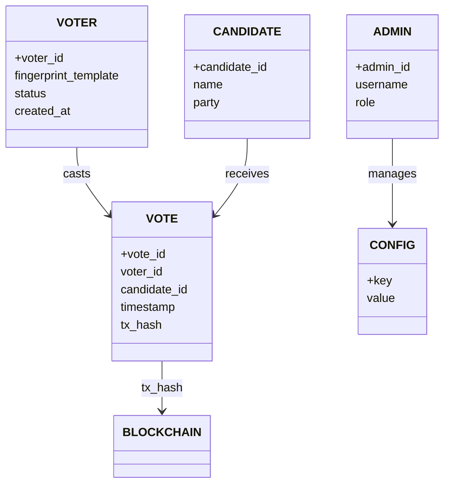
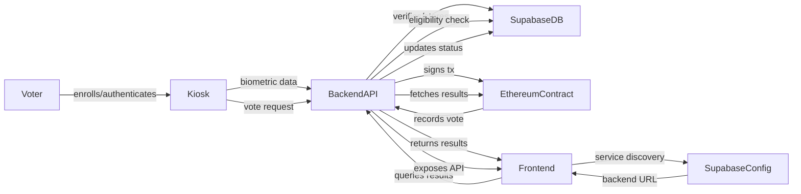

# Architecture — VoteChain V3

This document describes the system-level architecture for VoteChain V3, including logical components, deployment topology, and runtime interactions. Visual diagrams (SVGs) are included and committed to the `docs/` folder for reliable viewing.

---

## Overview

VoteChain V3 is a kiosk-based blockchain voting system composed of the following logical layers:

- Edge (Kiosk): Raspberry Pi devices that capture biometric input and relay actions to the backend.
- Backend: Node.js Express API that performs voter verification, transaction signing, and business logic.
- Data Layer: Supabase (Postgres) for voter mappings, configs (service discovery), and audit data.
- Blockchain: Ethereum Sepolia network, where the `VotingV3` smart contract records votes, emits events, and anchors the Merkle Root of the voter registry.
- Frontend: Static HTML/JS dashboards (voter results, admin UI, auditor toolkit) that discover the backend via Supabase.
- Connectivity: Ngrok Tunnel for exposing backend securely when needed.

---

## Components

- `Kiosk` — Runs `kiosk_main.py` (Python). Handles fingerprint reader, touchscreen/OLED, and local UI.
- `Backend API` — `backend/server.js` (Node.js, ESM). Authenticates requests from kiosks, communicates with Supabase and Ethereum.
- `Supabase` — Postgres DB + Auth + Storage. Stores biometric mappings, voter status, service discovery table, and logs.
- `Ethereum (Sepolia)` — Smart contract `VotingV3.sol` records votes, emits events, and stores the Merkle Root of the voter registry.
- `Frontend` — `index.html`, `admin.html`, `results.html`, `auditor.html`, `verify.html`, `simulator.html`. Discovers backend URL via Supabase and displays dashboards.
- `Ngrok Tunnel` — Secure tunnel for remote access to backend without exposing local network.

---

## Deployment Diagram

The diagram below shows the recommended deployment topology. The Mermaid flowchart renders directly in Markdown viewers that support Mermaid.

```mermaid
flowchart LR
  KioskCluster[Kiosk Cluster (Raspberry Pi devices)] -->|HTTPS| Backend[Backend Server (Node.js)]
  Backend -->|DB/API| Supabase[Supabase (Postgres)]
  Backend -->|RPC| Ethereum[Ethereum (Sepolia)]
  Cloudflare[Ngrok Tunnel] -->|Admin Access| Backend
  Frontend[Frontend] -->|Service discovery| Supabase
  Frontend -->|API calls| Backend
```

**Notes:**

- Backend runs on a server (cloud or edge) with environment variables stored in `.env`.
- Each kiosk is a Raspberry Pi running the kiosk software; they communicate to the backend over HTTPS.
- Supabase is cloud-hosted and reachable by backend and frontend.
- Cloudflare Tunnel can be used to expose backend securely to remote frontends or for admin access.

---

## Logical Diagram

The logical model shows the major data & entity relationships. A `classDiagram` is used here for broad Mermaid compatibility.



---

## Runtime Interaction Diagram

The runtime diagram illustrates the dataflow for enrollment, vote casting, and results retrieval.



---

## Operational Considerations

- Deploy backend behind a process manager or `systemd` with auto-restart.
- Ensure `.env` secret values (private key for signing, Supabase keys) are stored securely and not committed.
- Use HTTPS for kiosk-backend communications; validate certificates for Cloudflare Tunnel or reverse proxies.
- Monitor blockchain confirmations and backend logs to ensure votes were recorded.

---

## File references

- Smart contract: `contracts/VotingV3.sol` (inherits VotingV2)
- Backend server: `backend/server.js`
- Merkle utilities: `backend/utils/merkle.js`
- Audit routes: `backend/routes/auditor.js`
- Kiosk software: `kiosk/kiosk_main.py`
- Diagrams and diagrams source: `docs/DATAFLOW_DIAGRAM.md`, `docs/ENTITY_RELATIONSHIP_DIAGRAM.md`, `docs/ARCHITECTURE.md`

---

If you want I can also:

- Commit these new and updated doc files (I can create a Git commit and push or open a PR).
- Generate PNG versions of the SVGs for compatibility.
