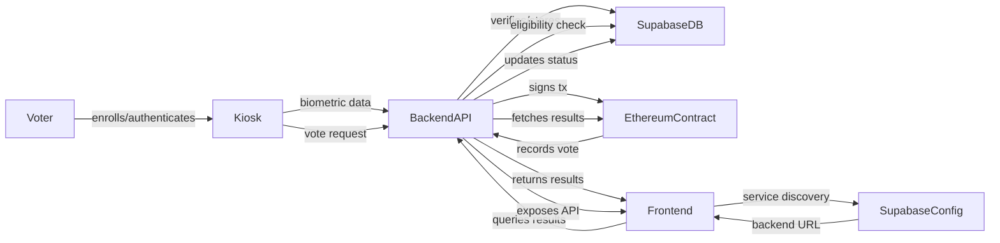

# Dataflow Diagram — VoteChain V3

This diagram describes the flow of data through the VoteChain V3 blockchain voting system, highlighting the interactions between the edge (kiosk), backend, database, blockchain, and frontend layers.

---

## 1. Overview

- **Actors:** Voter, Admin
- **Systems:** Kiosk (Raspberry Pi), Backend (Node.js), Supabase (DB & config), Ethereum (Sepolia), Frontend (HTML/JS)

---

## 2. Dataflow Steps

1. **Voter Enrollment**
   - Voter interacts with kiosk (fingerprint, button)
   - Kiosk sends biometric data to backend API
   - Backend verifies and stores mapping in Supabase
   - Backend updates voter status in DB

2. **Vote Casting**
   - Voter authenticates at kiosk
   - Kiosk sends vote request to backend
   - Backend checks eligibility in Supabase
   - Backend signs and submits transaction to Ethereum contract
   - Blockchain records vote
   - Backend updates voter status in Supabase

3. **Results Retrieval**
   - Frontend queries backend for results
   - Backend fetches results from Ethereum contract
   - Backend returns results to frontend
   - Frontend displays results dashboard

4. **Service Discovery**
   - Frontend queries Supabase config table for backend URL
   - Frontend connects to backend API

---

## 3. Dataflow Diagram (Textual)

- **Service Discovery:**
  - [Frontend] → [Supabase Config] → [Backend API]

---

## 4. Data Entities

- **Biometric Data:** Fingerprint templates, mapped to voter ID
- **Voter Status:** Enrollment, eligibility, vote cast
- **Vote Transaction:** Candidate ID, timestamp, voter ID (hashed)
- **Results:** Aggregated vote counts, blockchain event logs
- **Config:** Backend URL, contract address, system status

---

## 5. Diagram Key

- **→**: Data transfer (API call, transaction, query)
- **[ ]**: System/component
- **↓**: Downstream flow (e.g., contract interaction)

---

## 6. References

- See `docs/ARCHITECTURE.md` and `docs/SERVICE_DISCOVERY.md` for detailed diagrams and integration points.
