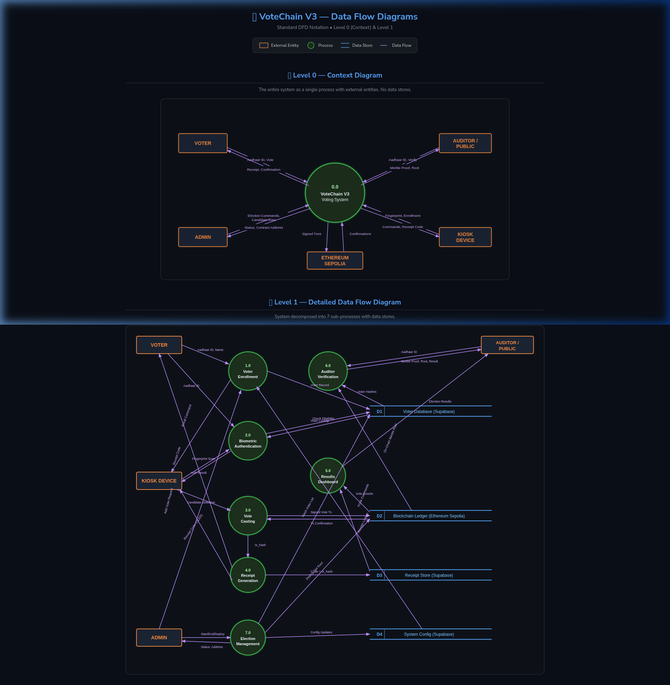

# Data Flow Diagrams — VoteChain V3

This document contains the **Level 0 (Context)** and **Level 1** Data Flow Diagrams for VoteChain V3, using standard DFD notation.

**Notation Used:**
- **Rectangle** → External Entity (source/sink)
- **Circle** → Process (labeled with number + verb)
- **Open-ended Rectangle** → Data Store
- **Arrow** → Data Flow (labeled with data name)

---

## Level 0 — Context Diagram

The entire system is represented as a single process (`0.0 VoteChain V3 Voting System`). No data stores are shown at this level.

### External Entities

| Entity | Role | Inputs to System | Outputs from System |
|--------|------|-------------------|---------------------|
| **Voter** | End user casting a vote | Aadhaar ID, Vote selection | Receipt code, Confirmation |
| **Admin** | Election officer managing system | Election commands, Candidate data | Status, Contract address |
| **Auditor / Public** | Independent verifier / general public | Aadhaar ID (for proof request) | Merkle Proof, Root, Election results |
| **Kiosk Device** | Raspberry Pi hardware | Fingerprint scan, Enrollment data | Commands, Receipt code (OLED) |
| **Ethereum Sepolia** | Blockchain network | — | Confirmations, Vote records |

---

## Level 1 — Detailed DFD

The system is decomposed into **7 sub-processes** and **4 data stores**.

### Processes

| # | Process | Description |
|---|---------|-------------|
| **1.0** | Voter Enrollment | Registers voters with Aadhaar ID, name, and fingerprint via kiosk |
| **2.0** | Biometric Authentication | Verifies voter identity via fingerprint scan and database lookup |
| **3.0** | Vote Casting | Submits signed vote transaction to the blockchain |
| **4.0** | Receipt Generation | Generates short-code receipt linked to blockchain tx_hash |
| **5.0** | Results Dashboard | Queries blockchain for vote counts and displays live results |
| **6.0** | Auditor Verification | Generates Merkle proofs and verifies voter inclusion in registry |
| **7.0** | Election Management | Admin controls: deploy contract, start/end election, set Merkle root |

### Data Stores

| ID | Store | Technology | Contents |
|----|-------|-----------|----------|
| **D1** | Voter Database | Supabase (PostgreSQL) | Voter records (aadhaar_hash, name, fingerprint_id, has_voted) |
| **D2** | Blockchain Ledger | Ethereum Sepolia | Votes, candidates, Merkle Root, nonces |
| **D3** | Receipt Store | Supabase (PostgreSQL) | Short codes mapped to tx_hashes |
| **D4** | System Config | Supabase (PostgreSQL) | Backend URL, kiosk commands, contract address |

### Key Data Flows

| From | To | Data | Description |
|------|----|------|-------------|
| Voter | 1.0 | Aadhaar ID, Name | Voter provides identity for enrollment |
| Voter | 2.0 | Aadhaar ID | Voter provides ID for check-in |
| Kiosk | 2.0 | Fingerprint Scan | Biometric verification input |
| 2.0 | D1 | Check Eligibility | Lookup voter record, verify not already voted |
| Kiosk | 3.0 | Candidate Selection | Physical button press on kiosk |
| 3.0 | D2 | Signed Vote Tx | Backend signs and submits to blockchain |
| D2 | 3.0 | Tx Confirmation | Blockchain confirms the vote |
| 3.0 | 4.0 | tx_hash | Pass transaction hash for receipt generation |
| 4.0 | D3 | Code + tx_hash | Store receipt mapping |
| 4.0 | Voter | Receipt Code | Human-readable short code |
| D2 | 5.0 | Vote Counts | Query candidate vote totals |
| 5.0 | Public | Election Results | Live dashboard data |
| Auditor | 6.0 | Aadhaar ID | Request Merkle proof for verification |
| D1 | 6.0 | Voter Hashes | All voter hashes to build Merkle tree |
| D2 | 6.0 | On-Chain Root | Merkle root stored in contract |
| 6.0 | Auditor | Proof, Root, Result | Verification result |
| Admin | 7.0 | Start/End/Deploy | Election management commands |
| 7.0 | D2 | Deploy, Set Root | Deploy contract, anchor Merkle root |
| 7.0 | D4 | Config Updates | Update backend URL, kiosk commands |

---

## Diagram Image

---

## References

- [ARCHITECTURE.md](ARCHITECTURE.md) — System architecture
- [ENTITY_RELATIONSHIP_DIAGRAM.md](ENTITY_RELATIONSHIP_DIAGRAM.md) — Database entity relationships
- [SECURITY.md](SECURITY.md) — Security model across data flows
