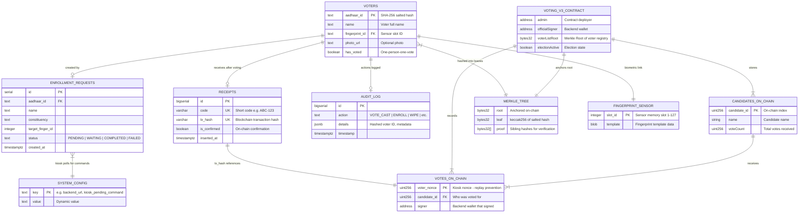
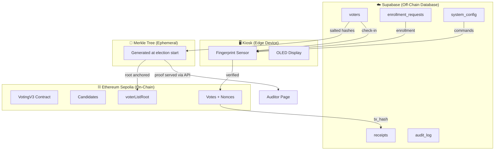

# Entity Relationship Diagram — VoteChain V3

This document describes all data entities and their relationships across the three data layers: **Supabase (off-chain)**, **Ethereum (on-chain)**, and the **Kiosk (edge)**.

---

## ER Diagram

---

## Data Layer Map

---

## Entity Details

### Supabase Tables

| Table | Primary Key | Purpose | RLS |
|-------|------------|---------|-----|
| `voters` | `aadhaar_id` (salted SHA-256) | Voter registry with biometric mapping | Service-role only for writes |
| `enrollment_requests` | `id` (serial) | Queue for kiosk enrollment commands | PII protected, no public read |
| `receipts` | `id` (bigserial) | Maps short codes to blockchain tx hashes | Public read, service-role write |
| `system_config` | `key` (text) | Service discovery, kiosk commands | Public read, service-role write |
| `audit_log` | `id` (bigserial) | Tamper-evident action log | Service-role only |

### Smart Contract State (VotingV3)

| State Variable | Type | Purpose |
|---------------|------|---------|
| `admin` | `address` | Contract owner (deployer) |
| `officialSigner` | `address` | Backend wallet authorized to sign votes |
| `voterListRoot` | `bytes32` | Merkle Root of the voter registry (set once) |
| `electionActive` | `bool` | Whether voting is currently open |
| `candidates[]` | `Candidate[]` | Array of candidates with vote counts |
| `usedNonces[]` | `mapping` | Prevents replay attacks via kiosk nonce |

### Kiosk (Edge)

| Component | Data Stored | Persistence |
|-----------|------------|-------------|
| Fingerprint Sensor | Templates (slots 1–127) | Non-volatile, survives reboot |
| OLED Display | None | Ephemeral display only |
| evdev Keyboard | None | Input device only |

---

## Key Relationships

1. **Voter → Receipt**: A voter who casts a vote receives a short-code receipt (`ABC-123`) linked to their blockchain transaction.
2. **Voter → Merkle Leaf**: Each voter's salted hash is Keccak-256'd into a Merkle leaf. The tree root is anchored on-chain.
3. **Receipt → Blockchain**: The `tx_hash` in the receipt maps 1:1 to an on-chain vote transaction.
4. **Enrollment → Kiosk**: Enrollment requests are queued in Supabase and polled by the kiosk via `system_config`.
5. **Contract → Merkle Root**: The `voterListRoot` is set once at election start and is immutable thereafter.

---

## References

- [supabase-schema.md](supabase-schema.md) — SQL create statements
- [ARCHITECTURE.md](ARCHITECTURE.md) — System architecture
- [PRIVACY.md](PRIVACY.md) — Data privacy and hashing details
- [SECURITY.md](SECURITY.md) — RLS policies and incident response
