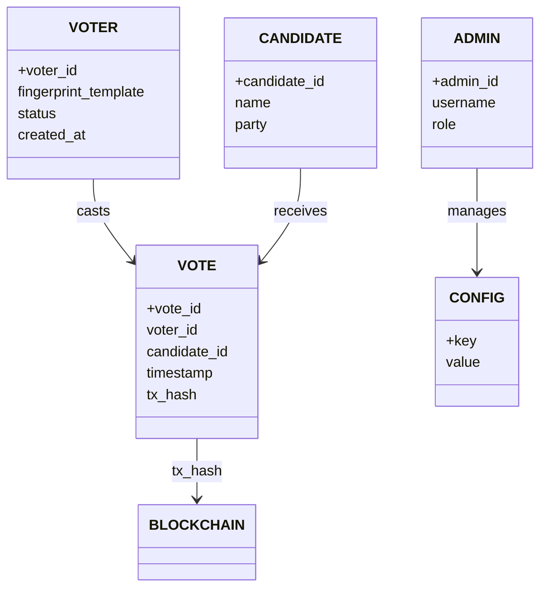

# Entity Relationship Diagram — VoteChain V3

This document describes the main entities and relationships in the VoteChain V3 blockchain voting system, focusing on the Supabase database and smart contract data structures.

---

## 1. Entities

- **Voter**
  - voter_id (PK)
  - fingerprint_template
  - status (enrolled, eligible, voted)
  - created_at

- **Candidate**
  - candidate_id (PK)
  - name
  - party

- **Vote**
  - vote_id (PK)
  - voter_id (FK)
  - candidate_id (FK)
  - timestamp
  - tx_hash (blockchain reference)

- **Admin**
  - admin_id (PK)
  - username
  - role

- **Config**
  - key (PK)
  - value

---

## 2. Relationships

- **Voter → Vote**: One-to-many (a voter can cast one vote, but for audit/history, may be modeled as one-to-many)
- **Candidate → Vote**: One-to-many (a candidate can receive many votes)
- **Admin → Config**: Admins manage system configuration
- **Vote → Blockchain**: Each vote is linked to a blockchain transaction (tx_hash)

---

## 3. ER Diagram (Renderable)

> Note: Some Mermaid renderers do not support `erDiagram`. A `classDiagram` is used here for broad compatibility; it represents the same relationships.

---

## 4. Entity Attributes

- **Voter**: Unique biometric mapping, status tracking
- **Candidate**: Identity, party affiliation
- **Vote**: Links voter, candidate, and blockchain tx
- **Admin**: System management
- **Config**: Service discovery, contract address, system status

---

## 5. References

- See `docs/ARCHITECTURE.md` and `docs/SERVICE_DISCOVERY.md` for further details on data models and integration.
