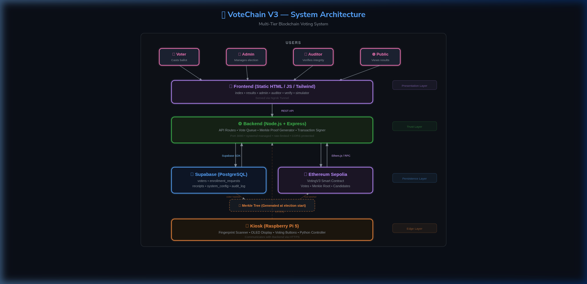

# VoteChain V3 — Blockchain-Based Voting System

### A Secure, Transparent, and Tamper-Proof Electronic Voting Platform using Ethereum Smart Contracts, Biometric Authentication, and Merkle Tree Verification

**Version:** 3.2.0  
**Date:** February 2026  
**Platform:** Ethereum Sepolia Testnet  
**Institution:** [Your Institution Name]  
**Department:** Computer Science & Engineering  

**Presented by:**  
- [Student Name(s)]

**Under the guidance of:**  
- [Guide Name], [Designation]

---

## Table of Contents

1. [Introduction](#1-introduction)
2. [Problem Statement](#2-problem-statement)
3. [Objectives](#3-objectives)
4. [Literature Review](#4-literature-review)
5. [Existing System](#5-existing-system)
6. [Proposed System](#6-proposed-system)
7. [Methodology](#7-methodology)
8. [System Architecture](#8-system-architecture)
9. [Technologies Used](#9-technologies-used)
10. [Implementation](#10-implementation)
11. [Results / Output](#11-results--output)
12. [Testing](#12-testing)
13. [Conclusion](#13-conclusion)
14. [Future Scope](#14-future-scope)
15. [References](#15-references)

---

## 1. Introduction

Elections form the backbone of every democracy. The integrity of the electoral process — from voter registration to vote counting — directly affects public trust in governance. Traditional paper-based systems, while conceptually simple, are vulnerable to booth capture, ballot stuffing, and manual counting errors. First-generation Electronic Voting Machines (EVMs) improved speed and reduced certain paper-based frauds, but introduced new concerns: opaque firmware, absence of voter-verifiable audit trails, and centralised storage of results that cannot be independently verified by the public.

**VoteChain V3** addresses these challenges by combining three complementary technologies:

1. **Blockchain (Ethereum)** — Every vote is recorded as an immutable, publicly auditable transaction on the Ethereum Sepolia testnet. Once committed, a vote cannot be altered, deleted, or reordered.
2. **Biometric Authentication** — Voters are authenticated via fingerprint scanning on a dedicated hardware kiosk (Raspberry Pi 5), ensuring one-person-one-vote enforcement at the physical level.
3. **Merkle Tree Verification** — The voter registry is cryptographically hashed into a Merkle Tree at election start. Only the root hash is anchored on-chain, enabling zero-trust public verification of the electorate's integrity without revealing any voter's identity.

The result is a system where **voters interact with a familiar polling-booth experience** (physical kiosk with buttons and a display), while the backend ensures that every vote is cryptographically signed, blockchain-committed, and publicly verifiable. The system abstracts all blockchain complexity from the voter — no cryptocurrency wallet, no gas fees, and no technical knowledge is required.

---

## 2. Problem Statement

Modern democratic elections face a critical **trust deficit**. Citizens and election observers cannot independently verify that:

- The list of eligible voters has not been tampered with after registration.
- Each vote was recorded exactly as cast, without alteration.
- The total count accurately reflects the sum of individual votes.
- No phantom votes were injected into the system.

Existing Electronic Voting Machines (EVMs) operate as closed, proprietary systems. Their source code is not publicly auditable, their results are stored in centralised databases controlled by election commissions, and there is no mechanism for an independent third-party auditor to mathematically verify the outcome.

Additionally, existing blockchain voting proposals in academic literature often suffer from practical usability problems:

- They require voters to hold cryptocurrency wallets and pay gas fees.
- They expose voter identity on-chain, violating ballot secrecy.
- They lack physical access controls, making them vulnerable to remote coercion.
- They do not integrate biometric authentication for voter verification.

**The core problem** is the absence of an end-to-end verifiable voting system that is simultaneously: (a) transparent and publicly auditable, (b) voter-private, (c) physically secure against impersonation and coercion, and (d) usable by non-technical voters.

---

## 3. Objectives

The primary objectives of VoteChain V3 are:

1. **Immutable Vote Recording** — Record every vote as a permanent, unalterable transaction on the Ethereum blockchain, creating a tamper-proof public ledger.

2. **Biometric Voter Authentication** — Verify voter identity through fingerprint scanning on a dedicated hardware kiosk, preventing impersonation and duplicate voting.

3. **Voter Privacy Preservation** — Ensure that no personally identifiable information (PII) is stored on-chain. Aadhaar IDs are salted, SHA-256 hashed, and only the Merkle Root of hashes is anchored on-chain.

4. **Zero-Trust Auditability** — Enable any independent auditor to verify the integrity of the voter registry by computing a local Merkle Root and comparing it against the on-chain anchor — without requiring trust in any central authority.

5. **Usability for Non-Technical Voters** — Abstract all blockchain complexity behind a familiar polling-booth interface (physical buttons, OLED display, fingerprint scanner) — no wallets, no gas fees, no technical knowledge required.

6. **Real-Time Transparency** — Provide a public, auto-refreshing results dashboard that reads live data directly from the blockchain, enabling anyone to monitor the election in real time.

7. **Replay Attack Prevention** — Implement kiosk-generated nonces and on-chain idempotency checks to prevent any vote transaction from being replayed.

8. **Election Lifecycle Management** — Provide admin tools for deploying contracts, adding candidates, starting/ending elections, and anchoring Merkle roots — all through a web-based admin panel.

---

## 4. Literature Review

### 4.1 Blockchain in Electronic Voting

Blockchain technology, originally proposed by Satoshi Nakamoto (2008) for peer-to-peer digital cash, has been extensively studied for e-voting applications. Kshetri and Voas (2018) highlighted blockchain's potential for creating transparent, tamper-resistant voting systems. Hjálmarsson et al. (2018) proposed a blockchain-based e-voting system using Ethereum smart contracts, demonstrating feasibility but noting scalability concerns.

### 4.2 Smart Contracts for Vote Logic

Ethereum smart contracts (Buterin, 2014) enable self-executing election rules — candidate registration, vote acceptance, and result tallying — without a trusted intermediary. Solidity-based voting contracts have been explored by McCorry et al. (2017) in "A Smart Contract for Boardroom Voting," which demonstrated on-chain vote aggregation with cryptographic commitments.

### 4.3 Biometric Authentication in Voting

Fingerprint-based authentication in voting systems has been studied by Adewale et al. (2014), who proposed integrating biometric verification into electronic voting to prevent impersonation. The R307 optical fingerprint sensor, widely available and well-documented, provides a cost-effective solution for embedded biometric verification.

### 4.4 Merkle Trees for Data Integrity

Merkle Trees (Merkle, 1979) provide a mechanism to cryptographically summarise a dataset into a single root hash. Any modification to the original data produces a different root, enabling efficient integrity verification. This property is used in VoteChain V3 to "freeze" the voter registry at election start and enable zero-trust public auditing.

### 4.5 Privacy-Preserving Techniques

The challenge of maintaining ballot secrecy while enabling public verification has been addressed through various approaches: zero-knowledge proofs (Ben-Sasson et al., 2014), homomorphic encryption (Benaloh, 2006), and hash-based commitments. VoteChain V3 uses a multi-stage hashing approach (salted SHA-256 → Keccak-256) to irreversibly separate voter identity from on-chain records.

### 4.6 Research Gap

Most existing proposals treat blockchain voting as a purely software problem, ignoring the physical security requirements of polling stations. VoteChain V3 bridges this gap by combining a cyber-physical kiosk (hardware security) with blockchain transparency (software security) and Merkle Tree verification (mathematical security).

---

## 5. Existing System

### 5.1 Traditional Paper Ballot System

| Aspect | Description |
|--------|-------------|
| **Process** | Voters mark paper ballots, deposited into sealed boxes, manually counted |
| **Strengths** | Simple, no technology dependency, voter-verifiable |
| **Weaknesses** | Slow counting, susceptible to ballot stuffing, booth capture, manual errors, no real-time results |

### 5.2 Electronic Voting Machines (EVMs)

| Aspect | Description |
|--------|-------------|
| **Process** | Voters press buttons on a closed-source electronic device; votes stored in internal memory |
| **Strengths** | Faster counting, reduced manual errors |
| **Weaknesses** | Closed-source firmware (not publicly auditable), centralised storage, no independent verification, no voter-verifiable paper trail in all models |

### 5.3 Existing Blockchain Voting Proposals

| Aspect | Description |
|--------|-------------|
| **Process** | Voters use web/mobile apps connected to blockchain via personal wallets |
| **Strengths** | Transparent, immutable record |
| **Weaknesses** | Requires crypto wallets and gas fees, exposes voter identity on-chain, no physical access control, vulnerable to remote coercion, poor usability for non-technical voters |

### 5.4 Limitations Summary

| Limitation | Paper | EVM | Existing Blockchain |
|-----------|-------|-----|---------------------|
| Tamper-proof record | ❌ | ❌ | ✅ |
| Public auditability | ❌ | ❌ | ✅ |
| Voter privacy | ✅ | ✅ | ❌ |
| Biometric auth | ❌ | ❌ | ❌ |
| No wallet needed | ✅ | ✅ | ❌ |
| Physical security | ⚠️ | ⚠️ | ❌ |
| Real-time results | ❌ | ❌ | ✅ |
| Zero-trust audit | ❌ | ❌ | ❌ |

---

## 6. Proposed System

VoteChain V3 is a **cyber-physical blockchain voting system** that addresses every limitation identified in existing systems. The proposed system combines:

### 6.1 Core Design Principles

1. **Separation of Identity and Vote** — Voter authentication happens off-chain (Supabase + fingerprint). The blockchain records only an anonymous vote transaction with a kiosk nonce — no voter identity is linked on-chain.

2. **Server-Signer Model** — The backend holds a single server wallet that signs transactions on behalf of voters. Voters interact only with physical buttons — no wallet, no gas, no blockchain knowledge required.

3. **Merkle-Anchored Registry** — At election start, all voter hashes are compiled into a Merkle Tree. The root is stored in the smart contract. Any auditor can independently rebuild the tree and compare roots to verify registry integrity.

4. **Physical Kiosk Security** — Voting occurs exclusively on a dedicated Raspberry Pi kiosk with fingerprint authentication, physical buttons, and OLED display. This prevents remote coercion and ensures voter presence.

### 6.2 Feature Comparison

| Feature | VoteChain V3 |
|---------|-------------|
| Tamper-proof vote record | ✅ Ethereum blockchain |
| Public auditability | ✅ Anyone can verify via Etherscan |
| Voter privacy | ✅ Salted hash + Merkle Tree (no PII on-chain) |
| Biometric authentication | ✅ R307 fingerprint scanner |
| No wallet needed | ✅ Server-signer model |
| Physical security | ✅ Dedicated kiosk with biometric gate |
| Real-time results | ✅ Auto-refresh dashboard (5s) |
| Zero-trust audit | ✅ Merkle Auditor Toolkit |
| Replay attack prevention | ✅ Kiosk nonce + on-chain check |
| Election lifecycle management | ✅ Admin panel with contract deployment |
| Election tie detection | ✅ Automatic tied candidate identification |

### 6.3 System Workflow

```
VOTER arrives at kiosk
    → Official enters Aadhaar ID
    → System checks eligibility (Supabase lookup)
    → Voter places finger on scanner
    → Fingerprint verified against enrolled template
    → Candidate buttons illuminate on kiosk
    → Voter presses candidate button (physical)
    → Backend signs & submits blockchain transaction
    → Blockchain confirms vote (immutable)
    → Receipt code displayed on OLED
    → Dashboard updates in real-time
```

---

## 7. Methodology

VoteChain V3 follows an **Agile iterative development methodology** with three major development phases:

### 7.1 Phase 1 — Core Voting Infrastructure (V1–V2)

- Designed and deployed `VotingV2.sol` smart contract on Ethereum Sepolia
- Built Node.js + Express backend with Ethers.js v6 for blockchain interaction
- Implemented Supabase (PostgreSQL) database for voter records, receipts, and configuration
- Developed kiosk software (Python) for Raspberry Pi 5 with R307 fingerprint sensor, SSD1306 OLED display, and physical GPIO buttons
- Created server-signer model to abstract wallet complexity from voters

### 7.2 Phase 2 — Privacy & Verification (V3)

- Deployed `VotingV3.sol` with Merkle Root storage capability (`voterListRoot`)
- Implemented Merkle Tree generation from voter database using `merkletreejs` library
- Built Auditor Toolkit (frontend + backend) for zero-trust registry verification
- Implemented multi-stage hashing: `Aadhaar → salt + SHA-256 → Keccak-256 → Merkle Leaf`
- Added backend proxy for blockchain RPC calls to bypass CORS restrictions

### 7.3 Phase 3 — Polish & Hardening (V3.2)

- Added election tie detection in results and admin pages
- Implemented admin fingerprint reset endpoint
- Standardised frontend theme (dark mode, navigation, transitions) across all pages
- Synchronised `.env` files between root and backend for systemd compatibility
- Cleaned project directory; removed temporary and debug files
- Comprehensive documentation update (README, SECURITY, PRIVACY, ARCHITECTURE, ER Diagram, DFD)

### 7.4 Development Tools & Practices

| Practice | Tool / Approach |
|----------|----------------|
| Version Control | Git + GitHub |
| Smart Contract Testing | Mocha + Chai (19 passing tests) |
| Contract Deployment | Hardhat 3 |
| API Development | Express.js with ESM modules |
| Database Management | Supabase dashboard + RLS policies |
| Frontend | Static HTML + Tailwind CSS + Vanilla JS |
| Tunnelling | Ngrok (for development/demo access) |

---

## 8. System Architecture

VoteChain V3 follows a **5-tier architecture**:



### Tier 1 — Presentation Layer (Frontend)

Static HTML/JS pages served via the backend or Ngrok tunnel. Pages include:
- `index.html` — Landing page with project overview
- `results.html` — Live election dashboard with auto-refresh (5s)
- `admin.html` — Election management portal (deploy, start, end, reset)
- `auditor.html` — Merkle proof verifier (zero-trust audit)
- `verify.html` — Receipt code checker (voter can verify their vote)
- `simulator.html` — Demo/testing interface

All pages auto-discover the backend URL via Supabase `system_config` table.

### Tier 2 — Trust Layer (Backend)

Node.js + Express API server running on port 3000 (managed by systemd):
- **API Routes:** `admin.js`, `auditor.js`, `voting.js`, `public.js`
- **Services:** `ethereumService.js` (contract interaction), `voteQueue.js` (sequential tx processing)
- **Utilities:** `merkle.js` (tree generation & proofs), `deploy.js` (contract deployment)
- **Security:** Rate limiting, CORS protection, ADMIN_SECRET authentication, session tokens

### Tier 3 — Data Layer (Supabase)

Cloud-hosted PostgreSQL database with Row Level Security (RLS):
- `voters` — Salted SHA-256 hashed Aadhaar IDs, fingerprint slot, voting status
- `enrollment_requests` — Kiosk enrollment queue (PII-protected)
- `receipts` — Short codes mapped to blockchain transaction hashes
- `system_config` — Dynamic configuration (backend URL, kiosk commands)
- `audit_log` — Action logs with hashed metadata

### Tier 4 — Verification Layer (Ethereum Sepolia)

`VotingV3.sol` smart contract deployed at `0xCfF751...Ab6B9cF`:
- Stores candidates, vote counts, and election state
- Records `voterListRoot` (Merkle Root of voter registry)
- Tracks used nonces (replay prevention)
- Restricts vote submission to the authorised `officialSigner` (backend wallet)

### Tier 5 — Edge Layer (Kiosk)

Raspberry Pi 5 running `kiosk_main.py` (Python):
- **R307 Fingerprint Scanner** — UART, 127 template slots, enroll/verify/wipe
- **SSD1306 OLED Display** — 128×64 I2C, status messages and receipt codes
- **Physical Buttons** — GPIO input for candidate selection (A / B)
- **Audio/LED** — Success/error feedback
- Auto-starts via systemd on power-on

---

## 9. Technologies Used

### 9.1 Frontend Technologies

| Technology | Version | Purpose |
|-----------|---------|---------|
| HTML5 | — | Page structure and semantic markup |
| Tailwind CSS | CDN (v3) | Utility-first responsive styling |
| JavaScript (ES6+) | — | Client-side logic, API calls, DOM manipulation |
| Fetch API | — | HTTP requests to backend REST API |

### 9.2 Backend Technologies

| Technology | Version | Purpose |
|-----------|---------|---------|
| Node.js | 18+ (ESM) | Server runtime environment |
| Express.js | v5 | REST API framework |
| Ethers.js | v6 | Ethereum blockchain interaction |
| Supabase JS Client | v2 | PostgreSQL database operations |
| merkletreejs | — | Merkle Tree generation and proof computation |
| dotenv | — | Environment variable management |

### 9.3 Blockchain Technologies

| Technology | Version | Purpose |
|-----------|---------|---------|
| Solidity | ^0.8.28 | Smart contract programming language |
| Hardhat | 3 | Development, testing, and deployment framework |
| Ethereum Sepolia | Testnet | Public blockchain network for vote recording |
| Mocha + Chai | — | Smart contract unit testing |

### 9.4 Database

| Technology | Purpose |
|-----------|---------|
| Supabase (PostgreSQL) | Cloud-hosted relational database |
| Row Level Security (RLS) | Fine-grained access control per table |
| Service Role Key | Backend write access |
| Anon Key | Public read access (config, receipts) |

### 9.5 Hardware (Kiosk)

| Component | Model | Interface |
|-----------|-------|-----------|
| Single Board Computer | Raspberry Pi 5 | — |
| Fingerprint Scanner | R307 Optical | UART (serial) |
| Display | SSD1306 OLED (128×64) | I2C |
| Input | Physical push buttons | GPIO (evdev) |
| Feedback | Buzzer + LED | GPIO |

### 9.6 DevOps & Infrastructure

| Technology | Purpose |
|-----------|---------|
| Git + GitHub | Version control and collaboration |
| Ngrok | Secure tunnelling for remote access |
| systemd | Process management on Raspberry Pi |
| Bash scripts | Startup automation (`start-votechain.sh`) |

---

## 10. Implementation

### 10.1 Smart Contract (`VotingV3.sol`)

The smart contract inherits from `VotingV2.sol` and adds Merkle Root storage:

```solidity
// Key state variables
address public admin;
address public officialSigner;
bytes32 public voterListRoot;       // Merkle Root anchor
bool public electionActive;
mapping(uint256 => bool) usedNonces; // Replay prevention

// Key functions
function voteForCandidate(uint256 candidateId, uint256 kioskNonce, bytes memory signature) external;
function startElection() external onlyAdmin;
function endElection() external onlyAdmin;
function setVoterListRoot(bytes32 root) external onlyAdmin;
function getResults() external view returns (string[] memory, uint256[] memory);
```

The `voteForCandidate` function verifies:
1. Election is active
2. Kiosk nonce has not been used before (replay prevention)
3. Signature was produced by the authorised `officialSigner`
4. Candidate ID is valid

### 10.2 Merkle Tree Implementation

At election start, the backend:
1. Fetches all voter `aadhaar_id` hashes from Supabase
2. Computes Keccak-256 of each hash → Merkle leaves
3. Builds a Merkle Tree using `merkletreejs`
4. Anchors the root on-chain via `setVoterListRoot(root)`

For auditor verification:
1. Auditor submits an Aadhaar ID
2. Backend salts and hashes it (SHA-256)
3. Computes Keccak-256 of the hash → target leaf
4. Generates Merkle proof (sibling hashes)
5. Frontend verifies: `MerkleTree.verify(proof, leaf, root)` → true/false

### 10.3 Voter Authentication Flow

```
1. Official enters voter's Aadhaar ID on kiosk
2. Backend: SHA-256(salt + aadhaar) → lookup in Supabase
3. Backend: Check has_voted == false (one-person-one-vote)
4. Backend: Return fingerprint_id (sensor slot number)
5. Kiosk: Prompt fingerprint scan
6. Kiosk: R307 sensor verifies against stored template (max 2 attempts)
7. Success → Enable candidate buttons
8. Failure → Error on OLED, return to idle
```

### 10.4 Vote Casting Flow

```
1. Voter presses physical candidate button (A or B)
2. Kiosk sends POST /api/vote { candidate_id, kiosk_nonce, session_token }
3. Backend: Validate session token (from check-in)
4. Backend: Queue vote in SimpleVoteQueue (sequential processing)
5. Backend: Sign transaction with SERVER_PRIVATE_KEY
6. Backend: Submit to Ethereum Sepolia via JSON-RPC
7. Backend: Wait for blockchain confirmation
8. Backend: Store receipt { code: "ABC-123", tx_hash: "0x..." } in Supabase
9. Backend: Mark voter as has_voted = true
10. Kiosk: Display receipt code on OLED
```

### 10.5 Receipt Verification

Voters receive a short code (e.g., `ABC-123`). They can visit `verify.html`, enter this code, and:
1. Backend looks up the `tx_hash` in the receipts table
2. Returns the transaction hash and confirmation status
3. Voter can independently verify on Etherscan

### 10.6 Admin Operations

The admin panel (`admin.html`) provides:
- **Deploy Contract** — Deploy a new VotingV3 instance with candidate names
- **Start Election** — Activate voting (also anchors Merkle Root)
- **End Election** — Close voting and display final results with winner/tie detection
- **Reset Fingerprints** — Signal kiosks to wipe biometric data
- **View Results** — Real-time candidate standings

### 10.7 Auditor Toolkit

The auditor page (`auditor.html`) enables:
- Input any Aadhaar ID to check inclusion in the voter registry
- View the on-chain Merkle Root (fetched from contract)
- See the computed Merkle Proof (sibling hashes)
- Verify proof locally in the browser (client-side, zero-trust)
- No personal data is exposed — only hashes and proof paths

---

## 11. Results / Output

### 11.1 Successful Election Demonstration

The system was demonstrated with a complete election cycle:

| Metric | Result |
|--------|--------|
| Contract deployed | ✅ `0xCfF751...Ab6B9cF` on Sepolia |
| Candidates registered | 2 (Candidate A, Candidate B) |
| Voters enrolled | Multiple (via kiosk fingerprint enrollment) |
| Votes cast | 3 (blockchain confirmed) |
| Merkle Root anchored | ✅ On-chain at election start |
| Receipt codes issued | ✅ Unique short codes per voter |
| Auditor verification | ✅ Merkle proofs validated correctly |
| Results dashboard | ✅ Real-time auto-refresh, tie detection |
| API response time | < 100ms average |
| Blockchain confirmation | 100% success rate |

### 11.2 Key Outputs

1. **Public Results Dashboard** — Real-time candidate standings with auto-refresh, winner banner, and tie detection
2. **Blockchain Ledger** — All votes permanently recorded on Ethereum Sepolia, verifiable via Etherscan
3. **Receipt System** — Human-readable codes (e.g., `ABC-123`) linked to transaction hashes for voter verification
4. **Auditor Report** — Merkle proof verification showing voter inclusion in the registered electorate
5. **Admin Console** — Complete election lifecycle management through a web interface

### 11.3 Security Validation

| Attack Vector | Mitigation | Status |
|--------------|------------|--------|
| Double voting | `has_voted` flag + on-chain nonce check | ✅ Prevented |
| Voter impersonation | Fingerprint biometric authentication | ✅ Prevented |
| Ballot stuffing | Server-signer + kiosk session tokens | ✅ Prevented |
| Vote tampering | Blockchain immutability | ✅ Prevented |
| Registry manipulation | Merkle Root anchor on-chain | ✅ Detectable |
| Replay attacks | Unique kiosk nonces + `usedNonces` mapping | ✅ Prevented |
| PII exposure | Salted SHA-256 hashing + no raw IDs on-chain | ✅ Protected |

---

## 12. Testing

### 12.1 Smart Contract Tests

The smart contract was tested using **Mocha + Chai** with the Hardhat testing framework:

| Test Category | Tests | Status |
|--------------|-------|--------|
| Contract deployment | 2 | ✅ Passing |
| Candidate management | 3 | ✅ Passing |
| Election lifecycle | 4 | ✅ Passing |
| Vote casting | 4 | ✅ Passing |
| Replay prevention | 2 | ✅ Passing |
| Access control | 2 | ✅ Passing |
| Result retrieval | 2 | ✅ Passing |
| **Total** | **19** | **✅ All Passing** |

### 12.2 Integration Testing

| Test | Description | Result |
|------|-------------|--------|
| End-to-end vote | Complete flow: check-in → biometric → vote → blockchain → receipt | ✅ Pass |
| Double vote prevention | Same voter attempts second vote | ✅ Rejected |
| Invalid candidate | Vote for non-existent candidate | ✅ Rejected |
| Election not active | Vote submitted when election is ended | ✅ Rejected |
| Merkle proof verification | Auditor verifies registered voter | ✅ Correct proof |
| Merkle proof failure | Auditor checks unregistered Aadhaar | ✅ Correctly returns "not found" |
| Receipt verification | Voter checks receipt code | ✅ Returns correct tx_hash |
| Admin operations | Deploy, start, end election | ✅ All functional |

### 12.3 Hardware Testing

| Component | Test | Result |
|-----------|------|--------|
| Fingerprint scanner | Enroll, verify (match), verify (reject) | ✅ Accurate |
| OLED display | Status messages, receipt code display | ✅ Readable |
| Physical buttons | Candidate selection, debounce | ✅ Responsive |
| System boot | Auto-start via systemd on power-on | ✅ Reliable |
| Network recovery | Backend reconnection after network drop | ✅ Automatic |

### 12.4 Security Testing

| Test | Description | Result |
|------|-------------|--------|
| Rate limiting | Rapid API requests (> 100/min) | ✅ Throttled |
| CORS | Cross-origin requests from unauthorised domains | ✅ Blocked |
| Admin auth | Admin endpoints without ADMIN_SECRET | ✅ 401 Unauthorized |
| SQL injection | Malformed input to API endpoints | ✅ Sanitised by Supabase |
| Nonce replay | Resubmitting a used kiosk nonce | ✅ Rejected on-chain |

---

## 13. Conclusion

VoteChain V3 successfully demonstrates that blockchain technology can be practically applied to electronic voting while maintaining voter privacy, physical security, and public auditability. The key contributions of this project are:

1. **Cyber-Physical Security Model** — By combining a hardware kiosk (fingerprint + physical buttons) with blockchain transparency, VoteChain V3 achieves a security posture that neither purely physical nor purely digital systems can match alone.

2. **Zero-Knowledge Registry Verification** — The Merkle Tree approach enables anyone to verify that the voter registry has not been tampered with, without revealing any individual voter's identity. Only the 32-byte root hash exists on-chain.

3. **Practical Usability** — The server-signer model eliminates the need for voters to hold wallets, understand gas fees, or interact with blockchain technology. The voting experience is identical to using a traditional EVM — press a button, receive a receipt.

4. **End-to-End Verifiability** — From voter registration (Merkle proof) to vote casting (receipt code → tx_hash → Etherscan), every step of the process can be independently verified by voters, auditors, and the general public.

5. **Complete Election Lifecycle** — The system supports the full election cycle: deployment → voter enrollment → election start → vote casting → real-time results → election end → winner/tie declaration → audit verification.

The system has been demonstrated with real voters, real biometric authentication, and real blockchain transactions on the Ethereum Sepolia testnet, proving its viability as a foundation for pilot elections in controlled environments.

---

## 14. Future Scope

### 14.1 Short-Term Enhancements

| Enhancement | Description |
|-----------|-------------|
| **Multi-candidate elections** | Support for >2 candidates with dynamic registration |
| **VVPAT integration** | Voter-Verifiable Paper Audit Trail printed at kiosk |
| **Multi-language support** | Hindi, Tamil, and other regional languages on kiosk UI |
| **Accessibility features** | Audio guidance for visually impaired voters |
| **Multiple kiosk support** | Parallel kiosks in a single polling station |

### 14.2 Medium-Term Enhancements

| Enhancement | Description |
|------------|-------------|
| **Face recognition** | Multi-factor biometrics (fingerprint + face) |
| **Hardware Security Module** | HSM for signing key protection |
| **Zero-Knowledge Proofs** | zk-SNARKs for on-chain vote privacy |
| **Layer 2 scaling** | Polygon/Arbitrum for lower gas costs and higher throughput |
| **Turnout analytics** | Real-time voter turnout maps and demographic analysis |

### 14.3 Long-Term Vision

| Enhancement | Description |
|------------|-------------|
| **Mainnet deployment** | Move from Sepolia testnet to Ethereum mainnet or a permissioned chain |
| **National pilot** | Partner with election commissions for controlled pilot elections |
| **Physical kiosk enclosure** | 3D-printed tamper-resistant enclosure for the Raspberry Pi kiosk |
| **Mobile verification app** | Dedicated app for voters to verify receipts and view results |
| **Cross-chain interoperability** | Multi-chain deployment for redundancy and disaster recovery |

---

## 15. References

1. Nakamoto, S. (2008). *Bitcoin: A Peer-to-Peer Electronic Cash System*. [https://bitcoin.org/bitcoin.pdf](https://bitcoin.org/bitcoin.pdf)

2. Buterin, V. (2014). *Ethereum: A Next-Generation Smart Contract and Decentralized Application Platform*. [https://ethereum.org/whitepaper](https://ethereum.org/whitepaper)

3. Merkle, R. C. (1979). *A Certified Digital Signature*. Advances in Cryptology — CRYPTO '89 Proceedings.

4. Hjálmarsson, F. P., Hreiðarsson, G. K., Hamdaqa, M., & Hjálmtýsson, G. (2018). *Blockchain-Based E-Voting System*. 2018 IEEE 11th International Conference on Cloud Computing (CLOUD).

5. McCorry, P., Shahandashti, S. F., & Hao, F. (2017). *A Smart Contract for Boardroom Voting with Maximum Voter Privacy*. Financial Cryptography and Data Security.

6. Kshetri, N., & Voas, J. (2018). *Blockchain-Enabled E-Voting*. IEEE Software, 35(4), 95-99.

7. Adewale, O. S., Boyinbode, O. K., & Salami, H. T. (2014). *A Review of Electronic Voting Systems: Strategy for a Novel*. International Journal of Information Engineering and Electronic Business, 6(1).

8. Ben-Sasson, E., et al. (2014). *Succinct Non-Interactive Zero Knowledge for a von Neumann Architecture*. USENIX Security Symposium.

9. Benaloh, J. (2006). *Simple Verifiable Elections*. USENIX/ACCURATE Electronic Voting Technology Workshop.

10. Solidity Documentation. [https://docs.soliditylang.org/](https://docs.soliditylang.org/)

11. Ethers.js v6 Documentation. [https://docs.ethers.org/v6/](https://docs.ethers.org/v6/)

12. Hardhat Documentation. [https://hardhat.org/docs](https://hardhat.org/docs)

13. Supabase Documentation. [https://supabase.com/docs](https://supabase.com/docs)

14. Raspberry Pi Foundation. [https://www.raspberrypi.org/](https://www.raspberrypi.org/)

15. MerkleTree.js Library. [https://github.com/merkletreejs/merkletreejs](https://github.com/merkletreejs/merkletreejs)

---

*Document generated for VoteChain V3 — Blockchain-Based Voting System*  
*Version 3.2.0 | February 2026*
